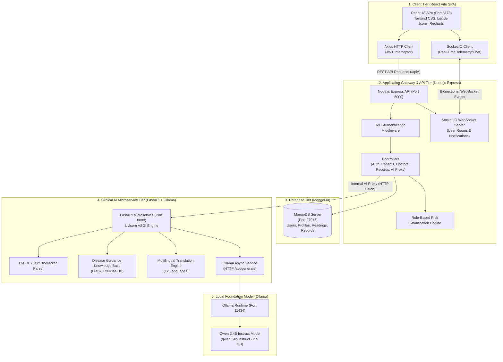
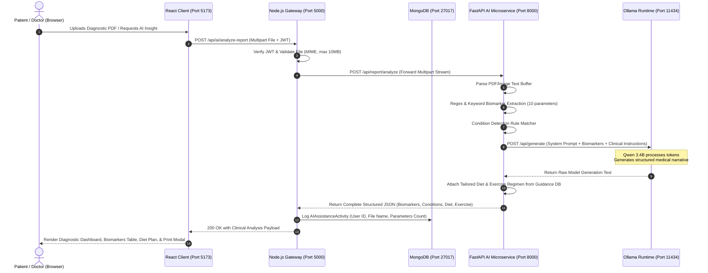

# 🏥 Smart Healthcare Ecosystem
## Complete System Architecture, Inter-Service Communication, LLM Workflows & Execution Manual

---

## 📑 Table of Contents

1. [Project Overview & Capabilities](#1-project-overview--capabilities)
2. [End-to-End System Architecture](#2-end-to-end-system-architecture)
   - [Architectural Topology](#architectural-topology)
   - [Service Responsibility Matrix](#service-responsibility-matrix)
3. [Frontend & Backend Connection Architecture](#3-frontend--backend-connection-architecture)
   - [RESTful HTTP Layer & Axios Interceptors](#restful-http-layer--axios-interceptors)
   - [Real-Time WebSockets (Socket.IO)](#real-time-websockets-socketio)
   - [Microservice Proxy Architecture (Node.js ↔ FastAPI)](#microservice-proxy-architecture-nodejs--fastapi)
4. [LLM & AI Microservice Request/Response Workflow](#4-llm--ai-microservice-requestresponse-workflow)
   - [Complete End-to-End AI Request Sequence](#complete-end-to-end-ai-request-sequence)
   - [Diagnostic Report Extraction Pipeline (PDF/Image)](#diagnostic-report-extraction-pipeline-pdfimage)
   - [Disease-Specific Care Generation (Diet & Physiotherapy)](#disease-specific-care-generation-diet--physiotherapy)
   - [Doctor Clinical Decision Support (CDSS) Workflow](#doctor-clinical-decision-support-cdss-workflow)
   - [Multilingual Translation Engine (12 Indian Languages)](#multilingual-translation-engine-12-indian-languages)
   - [Voice Processing & Text-to-Speech (TTS) Flow](#voice-processing--text-to-speech-tts-flow)
   - [Resilience & Fallback Strategy](#resilience--fallback-strategy)
5. [Frontend & Backend Core Workflows](#5-frontend--backend-core-workflows)
   - [Patient Journey & Telemetry Monitoring](#patient-journey--telemetry-monitoring)
   - [Doctor Practice & Consultation Workflow](#doctor-practice--consultation-workflow)
   - [Automated AI Risk Stratification Engine](#automated-ai-risk-stratification-engine)
6. [Step-by-Step Execution & Deployment Guide](#6-step-by-step-execution--deployment-guide)
   - [Prerequisites](#prerequisites)
   - [1. Ollama & Qwen LLM Setup](#1-ollama--qwen-llm-setup)
   - [2. Python FastAPI AI Microservice Setup (with venv)](#2-python-fastapi-ai-microservice-setup-with-venv)
   - [3. Node.js Backend Setup & Database Seeding](#3-nodejs-backend-setup--database-seeding)
   - [4. React Vite Frontend Setup](#4-react-vite-frontend-setup)
   - [5. One-Click Launch Options](#5-one-click-launch-options)
7. [Default Service Ports & Demo Credentials](#7-default-service-ports--demo-credentials)
   - [Port Allocation Summary](#port-allocation-summary)
   - [Demo User Accounts](#demo-user-accounts)
8. [API Request & Response Payload Reference](#8-api-request--response-payload-reference)

---

## 1. Project Overview & Capabilities

The **Smart Healthcare Ecosystem** is an enterprise-grade, multi-tier digital telemedicine and remote health monitoring platform designed for real-time telemetry surveillance, electronic health records (EHR) management, clinical consultations, and edge-first artificial intelligence assistance.

### Key Capabilities:
- **Privacy-First Local AI**: Powered by **Ollama** running the **Qwen** large language model (`qwen3:4b-instruct`) locally. Zero patient data leaves the premise to third-party proprietary APIs.
- **Automated Biomarker Extraction**: Reads diagnostic lab reports (PDF, PNG, JPG), automatically extracting 10 critical biomarkers (Hemoglobin, Glucose, Blood Pressure, Heart Rate, SpO2, Temperature, Total Cholesterol, WBC, RBC, Platelets) and flagging abnormal deviations.
- **Disease-Specific Nutrition & Physiotherapy**: Automatically links diagnostic findings to evidence-based meal plans (breakfast, lunch, dinner, snacks, hydration) and tailored physiotherapy exercises.
- **Doctor Clinical Decision Support (CDSS)**: Equips physicians with one-click case syntheses, differential diagnoses, recommended diagnostic workups, and red-flag hospital admission warnings.
- **12 Indian & Global Languages**: Full clinical translation support for English, Telugu (`తెలుగు`), Hindi (`हिन्दी`), Tamil (`தமிழ்`), Kannada (`ಕನ್ನಡ`), Malayalam (`മലയാളം`), Marathi (`मराठी`), Bengali (`বাংলা`), Gujarati (`ગુજરાતી`), Punjabi (`ਪੰਜਾਬੀ`), Odia (`ଓଡ଼ିଆ`), and Urdu (`اردو`).
- **Interactive Speech Recognition & TTS**: Hands-free voice query processing with native speech synthesis.
- **Printable Clinical Summary Export**: One-click generation of laboratory diagnostic summaries ready for hospital records or physical printing.

---

## 2. End-to-End System Architecture

### Architectural Topology



### Service Responsibility Matrix

| Service | Port | Primary Responsibilities |
|---|---|---|
| **React Frontend** | `5173` | User interface, state management, role-based dashboards, speech recognition, audio playback, report upload & print rendering. |
| **Node.js Express API** | `5000` | Authentication, authorization, database operations, business logic, WebSocket dispatching, AI microservice proxying. |
| **MongoDB Database** | `27017` | Persistent storage for users, medical records, appointments, vitals telemetry, notifications, and AI activity audit logs. |
| **FastAPI Microservice**| `8000` | Natural language processing, medical document parsing, biomarker extraction, translation, voice intent mapping, disease clinical guidance. |
| **Ollama Server** | `11434` | Local model execution, prompt tokenization, inference processing for Qwen without external API requirements. |

---

## 3. Frontend & Backend Connection Architecture

### RESTful HTTP Layer & Axios Interceptors

The React application connects to the Node.js backend through a configured Axios singleton located at `frontend/client/src/services/api.js`.

```javascript
// frontend/client/src/services/api.js
import axios from 'axios';

const API = axios.create({
  baseURL: import.meta.env.VITE_API_URL || 'http://localhost:5000/api',
  timeout: 90000, // 90 seconds to allow for LLM inference calls
});

// Automatic JWT Authorization Header Injection
API.interceptors.request.use((config) => {
  const token = localStorage.getItem('token');
  if (token) {
    config.headers.Authorization = `Bearer ${token}`;
  }
  return config;
});
```

- **Base URL Routing**: All client calls target `http://localhost:5000/api`.
- **Token Injection**: Every authenticated request includes `Authorization: Bearer <JWT>`.
- **CORS Protection**: The Express backend explicitly allows origins `http://localhost:5173`, `http://127.0.0.1:5173`, `http://localhost:3000`, and `http://127.0.0.1:3000` with `credentials: true`.

### Real-Time WebSockets (Socket.IO)

Real-time notifications, critical telemetry alerts, and doctor-patient chat communicate via WebSockets:
1. **Client Connection**: When a user logs in, `socket.io-client` connects to `http://localhost:5000`.
2. **Room Joining**: The client emits `join_user_room(userId)`.
3. **Targeted Dispatch**: When an emergency alert or chat message occurs, the backend emits `chat_message_received` or `new_notification` directly to the `user_${recipientId}` room.

### Microservice Proxy Architecture (Node.js ↔ FastAPI)

The Node.js Express server acts as a secure API gateway between the public frontend and the internal FastAPI microservice:
1. **Security**: The FastAPI microservice is isolated and never directly exposed to unauthorized client requests.
2. **Audit Logging**: The Node.js controller logs all AI usage into the `AIAssistanceActivity` collection in MongoDB.
3. **Seamless Fallback**: If the FastAPI service or Ollama is temporarily slow or restarting, Node.js catches the exception and returns rule-based clinical fallbacks so the user interface never breaks.

---

## 4. LLM & AI Microservice Request/Response Workflow

### Complete End-to-End AI Request Sequence



### Diagnostic Report Extraction Pipeline (PDF/Image)

1. **Upload Handling**: In [report_service.py](file:///c:/Users/summi/OneDrive/Desktop/major%20project%202.0/ai-service/app/services/report_service.py), reports are ingested as byte streams (PDF or common image formats).
2. **Text Extraction**:
   - For PDFs: `pypdf.PdfReader` extracts textual content across pages.
   - For plain text/scans: direct decoding or fallback extraction.
3. **Biomarker Parsing**: Extracted text is evaluated against medical regex pattern matchers:
   - *Hemoglobin*: Reference `13.5 - 17.5 g/dL`
   - *Fasting Blood Glucose*: Reference `70 - 100 mg/dL`
   - *Blood Pressure (Systolic/Diastolic)*: Reference `< 120 / < 80 mmHg`
   - *Heart Rate*: Reference `60 - 100 BPM`
   - *SpO2 (Pulse Oximetry)*: Reference `95 - 100%`
   - *Body Temperature*: Reference `36.5 - 37.5 °C`
   - *Total Cholesterol*: Reference `< 200 mg/dL`
   - *WBC (Leukocytes)*: Reference `4,500 - 11,000 /mcL`
   - *RBC (Erythrocytes)*: Reference `4.5 - 5.9 M/mcL`
   - *Platelets*: Reference `150,000 - 450,000 /mcL`
4. **Deviation Analysis**: Each biomarker is tagged with status (`Normal`, `Elevated`, `High`, or `Low`).

### Disease-Specific Care Generation (Diet & Physiotherapy)

When elevated parameters or clinical patterns are detected, the system maps the condition to evidence-based medical protocols:

| Condition Key | Trigger Criteria | Specialized Dietary Plan | Physiotherapy / Physical Regimen |
|---|---|---|---|
| `DIABETES` | Glucose ≥ 140 mg/dL | High-fiber complex carbs, non-starchy greens, low glycemic fruits (guava, berries), lean proteins. | Post-meal brisk walking (15-20 min), light cycling, resistance bands (low impact). |
| `HYPERTENSION` | BP ≥ 140/90 mmHg | DASH diet, sodium restriction (< 1,500 mg/day), potassium-rich foods (bananas, spinach). | Moderate aerobic walking (30 min 5x/wk), deep diaphragmatic breathing, swimming. |
| `ANEMIA` | Hemoglobin < 12.0 g/dL | Iron-rich foods (lentils, beetroot, spinach), Vitamin C enhancers (citrus, amla). | Gentle restorative yoga, low-intensity pacing, scheduled recovery breaks. |
| `DYSLIPIDEMIA` | Cholesterol ≥ 200 mg/dL | Mediterranean pattern, soluble fiber (oats, chia), omega-3 rich walnuts and flaxseeds. | Aerobic cardio (cycling, jogging 25 min 4x/wk), progressive resistance training. |
| `GENERAL_WELLNESS` | Normal ranges | Balanced macronutrients, whole grains, 2.5L clean hydration. | Standard daily functional mobility, core stability, 8,000-10,000 steps/day. |

### Doctor Clinical Decision Support (CDSS) Workflow

When a doctor clicks **"AI Insights"** on the Doctor Dashboard:
1. **Frontend Call**: Client calls `POST /api/ai/doctor-clinical-summary` with patient demographics and vitals.
2. **Clinical System Prompt**: Formulated specifically for physician review:
   ```text
   You are an expert Clinical Decision Support AI Assistant for licensed physicians.
   Analyze this patient presentation and provide a structured, high-yield clinical case summary:
   PATIENT: Name, Age, Gender, Blood Group, Risk Score
   VITALS: BP, HR, SpO2, Blood Glucose, Temperature
   CONDITIONS & ALLERGIES: Chronic history, active symptoms

   FORMAT YOUR RESPONSE IN PROFESSIONAL MEDICAL SECTIONS:
   1. CLINICAL IMPRESSION & RISK LEVEL
   2. DIFFERENTIAL DIAGNOSES (Top 3 with rationale)
   3. RECOMMENDED WORKUP (Targeted labs or imaging)
   4. THERAPEUTIC & LIFESTYLE CONSIDERATIONS
   5. RED FLAGS & CRITICAL WARNING SIGNS
   ```
3. **Execution**: Sent to Ollama Qwen (`qwen3:4b-instruct`).
4. **UI Display**: Formatted inside the Doctor's patient dossier with one-click **"Copy to Consultation"** for easy pasting into prescription notes.

### Multilingual Translation Engine (12 Indian Languages)

The microservice includes a translation service ([translation_service.py](file:///c:/Users/summi/OneDrive/Desktop/major%20project%202.0/ai-service/app/services/translation_service.py)) supporting:
1. **English** (`en-US`)
2. **Telugu** (`te-IN` - తెలుగు)
3. **Hindi** (`hi-IN` - हिन्दी)
4. **Tamil** (`ta-IN` - தமிழ்)
5. **Kannada** (`kn-IN` - ಕನ್ನಡ)
6. **Malayalam** (`ml-IN` - മലയാളം)
7. **Marathi** (`mr-IN` - मराठी)
8. **Bengali** (`bn-IN` - বাংলা)
9. **Gujarati** (`gu-IN` - ગુજરાતી)
10. **Punjabi** (`pa-IN` - ਪੰਜਾਬੀ)
11. **Odia** (`or-IN` - ଓଡ଼ିଆ)
12. **Urdu** (`ur-IN` - اردو)

### Voice Processing & Text-to-Speech (TTS) Flow

1. **Speech-to-Text**: Utilizes the browser's native `webkitSpeechRecognition` or `SpeechRecognition` API localized to the user's selected language.
2. **Intent Parsing**: The transcript is transmitted to `POST /api/voice/process` on FastAPI.
3. **Action Dispatch**: If the patient says *"What food should I eat?"*, the AI dispatches action `SCROLL_DIET` with an accompanying voice response.
4. **Audio Playback**: The frontend uses `window.speechSynthesis` with matching voice locale to read answers aloud.

### Resilience & Fallback Strategy

If Ollama is loading, temporarily busy, or updating:
- The FastAPI microservice catches the timeout gracefully and switches to pre-compiled clinical rule engines.
- The Node.js server catches any HTTP connection failure and returns a structured clinical fallback instead of returning HTTP 500.
- The patient or doctor receives accurate guidance with an informative banner without application disruption.

---

## 5. Frontend & Backend Core Workflows

### Patient Journey & Telemetry Monitoring
1. **Authentication**: Patient logs in with email/password; receives a JWT with role `PATIENT`.
2. **Telemetry Ingestion**: Patient enters health readings (Heart Rate, Blood Pressure, Glucose, SpO2, Temperature).
3. **Automated Risk Scoring**: `aiRiskService.js` calculates vital anomalies, assigning risk level (`LOW`, `MEDIUM`, `HIGH`, `CRITICAL`).
4. **Emergency Escalation**: If vitals cross danger thresholds (e.g., Systolic BP > 180 or SpO2 < 90%), an `EmergencyAlert` is automatically generated and broadcast to attending physicians over WebSockets.

### Doctor Practice & Consultation Workflow
1. **Dashboard Overview**: Displays clinical KPIs (total patients, confirmed appointments, high-risk flags, emergency alerts) and risk distribution charts.
2. **Patient Surveillance**: Table sorting by risk level with real-time biometric telemetry.
3. **AI Case Analysis**: One-click **"AI Insights"** evaluates the patient's entire profile using local Qwen inference.
4. **Prescription Management**: Doctors issue digital prescriptions with medicine name, dosage, frequency, and instructions.

### Automated AI Risk Stratification Engine
- **Normal Score (0-20)**: All vitals within reference ranges → `LOW` Risk.
- **Moderate Score (21-50)**: Single mild deviation (e.g. BP 135/88) → `MEDIUM` Risk.
- **High Score (51-80)**: Multiple deviations (e.g. Glucose 160 + BP 145/95) → `HIGH` Risk.
- **Critical Score (81-100)**: Acute vital abnormalities (e.g. SpO2 < 90% or Heart Rate > 130) → `CRITICAL` Risk (Triggers emergency notification).

---

## 6. Step-by-Step Execution & Deployment Guide

### Prerequisites
- **Operating System**: Windows 10/11, macOS, or Linux
- **Node.js**: v18.0.0 or higher
- **Python**: v3.10, v3.11, or v3.12
- **MongoDB**: Community Server running locally on port `27017`
- **Ollama**: Installed from [ollama.com](https://ollama.com)

---

### 1. Ollama & Qwen LLM Setup

1. Start the Ollama server:
   ```powershell
   ollama serve
   ```
2. Pull the official Qwen model (if not already downloaded):
   ```powershell
   ollama pull qwen3:4b-instruct
   ```
3. Verify that the model is downloaded:
   ```powershell
   ollama list
   ```
   *(Ensure `qwen3:4b-instruct` appears in the list).*

---

### 2. Python FastAPI AI Microservice Setup (with venv)

Navigate to the `ai-service` directory:
```powershell
cd "c:\Users\summi\OneDrive\Desktop\major project 2.0\ai-service"
```

#### Step A: Create and Activate Virtual Environment
- **Create Virtual Environment**:
  ```powershell
  python -m venv venv
  ```
- **Activate Virtual Environment on Windows (PowerShell)**:
  ```powershell
  .\venv\Scripts\Activate.ps1
  ```
  *(Or in Windows Command Prompt: `.\venv\Scripts\activate.bat`)*

#### Step B: Install Requirements
```powershell
pip install -r requirements.txt
```

#### Step C: Verify Environment Variables (`.env`)
Ensure `.env` in `ai-service` contains:
```env
OLLAMA_BASE_URL=http://localhost:11434
OLLAMA_MODEL=qwen3:4b-instruct
NODE_BACKEND_URL=http://localhost:5000
MAX_UPLOAD_SIZE_MB=10
PORT=8000
HOST=0.0.0.0
```

#### Step D: Run the FastAPI Microservice
```powershell
uvicorn app.main:app --reload --port 8000
```
- Interactive Swagger Documentation: [http://localhost:8000/docs](http://localhost:8000/docs)
- Health Check: [http://localhost:8000/health](http://localhost:8000/health)

---

### 3. Node.js Backend Setup & Database Seeding

Open a new terminal and navigate to `backend`:
```powershell
cd "c:\Users\summi\OneDrive\Desktop\major project 2.0\backend"
```

#### Step A: Install Dependencies
```powershell
npm install
```

#### Step B: Verify Environment File (`.env`)
Ensure `.env` in `backend` contains:
```env
PORT=5000
NODE_ENV=development
MONGO_URI=mongodb://127.0.0.1:27017/smart_healthcare
JWT_SECRET=smart_healthcare_super_secret_jwt_key_2026_major_project
CLIENT_URL=http://localhost:5173
AI_SERVICE_URL=http://localhost:8000
```

#### Step C: Seed Demo Data
Populate MongoDB with demo doctors, patients, vitals readings, and appointments:
```powershell
npm run seed
```

#### Step D: Start the Backend Server
```powershell
npm run dev
```
*(Runs on `http://localhost:5000` with WebSocket support).*

---

### 4. React Vite Frontend Setup

Open a third terminal and navigate to `frontend/client`:
```powershell
cd "c:\Users\summi\OneDrive\Desktop\major project 2.0\frontend\client"
```

#### Step A: Install Dependencies
```powershell
npm install
```

#### Step B: Start Development Server
```powershell
npm run dev
```
The React SPA will be available at [http://localhost:5173](http://localhost:5173).

---

### 5. One-Click Launch Options

For convenience, ready-to-run automation scripts are included in the root directory:

#### Option 1: PowerShell Automation (Recommended)
```powershell
cd "c:\Users\summi\OneDrive\Desktop\major project 2.0"
.\start-all.ps1
```
This script checks Ollama status, launches the FastAPI AI microservice, starts the Node backend, and boots the React frontend in coordinated terminal sessions.

#### Option 2: Individual Windows Batch Launchers
Double-click each file in the project root:
1. `start-ai-service.bat` (Port 8000)
2. `start-backend.bat` (Port 5000)
3. `start-frontend.bat` (Port 5173)

---

## 7. Default Service Ports & Demo Credentials

### Port Allocation Summary

| Service | Port | URL |
|---|---|---|
| **Frontend Web App** | `5173` | [http://localhost:5173](http://localhost:5173) |
| **Node.js Express API** | `5000` | [http://localhost:5000](http://localhost:5000) |
| **FastAPI Microservice** | `8000` | [http://localhost:8000](http://localhost:8000) |
| **FastAPI Swagger Docs** | `8000` | [http://localhost:8000/docs](http://localhost:8000/docs) |
| **Ollama Local LLM** | `11434`| [http://localhost:11434](http://localhost:11434) |
| **MongoDB Database** | `27017`| `mongodb://127.0.0.1:27017/smart_healthcare` |

### Demo User Accounts

All accounts are pre-seeded and ready for login:

| Role | Email | Password | Name / Details |
|---|---|---|---|
| **Patient** | `patient@example.com` | `Patient@123` | **Rahul Verma** (34 yrs, High Risk Telemetry) |
| **Patient** | `patient.ananya@example.com` | `Patient@123` | **Ananya Iyer** (28 yrs, Normal Telemetry) |
| **Doctor** | `doctor@example.com` | `Doctor@123` | **Dr. Aarav Sharma** (Cardiologist) |
| **Doctor** | `doctor.priya@example.com` | `Doctor@123` | **Dr. Priya Patel** (Endocrinologist) |
| **Doctor** | `doctor.vikram@example.com` | `Doctor@123` | **Dr. Vikram Malhotra** (Pulmonologist) |
| **Admin** | `admin@example.com` | `Admin@123` | **System Administrator** |

---

## 8. API Request & Response Payload Reference

### 1. AI Health Assistant Chat
- **Endpoint**: `POST /api/ai/chat`
- **Headers**: `Authorization: Bearer <JWT>`, `Content-Type: application/json`
- **Request Payload**:
  ```json
  {
    "message": "What foods should I avoid if my fasting glucose is 145 mg/dL?",
    "language": "English",
    "simpleLanguage": false
  }
  ```
- **Response Payload**:
  ```json
  {
    "success": true,
    "data": {
      "reply": "With a fasting glucose of 145 mg/dL, you should limit refined carbohydrates, white flour, sugary drinks, and packaged snacks. Focus on high-fiber greens, whole grains, and lean proteins...",
      "disclaimer": "This information is for educational purposes only. Always consult your doctor before modifying your diet.",
      "language": "English",
      "model_used": "qwen3:4b-instruct"
    }
  }
  ```

### 2. Doctor AI Clinical Decision Support
- **Endpoint**: `POST /api/ai/doctor-clinical-summary`
- **Headers**: `Authorization: Bearer <JWT>`, `Content-Type: application/json`
- **Request Payload**:
  ```json
  {
    "patientName": "Rahul Verma",
    "age": 34,
    "gender": "Male",
    "bloodGroup": "B+",
    "vitals": {
      "systolicBP": 145,
      "diastolicBP": 95,
      "heartRate": 88,
      "spo2": 97,
      "bloodGlucose": 155,
      "temperature": 36.8
    },
    "riskLevel": "HIGH",
    "conditions": ["Elevated Blood Glucose", "Stage 1 Hypertension"]
  }
  ```
- **Response Payload**:
  ```json
  {
    "success": true,
    "data": {
      "summary": "### 🩺 Clinical Impression\nPatient Rahul Verma presents with a HIGH cardiometabolic risk profile...\n\n### 🔬 Differential Diagnoses\n1. Type 2 Diabetes Mellitus with secondary vascular tension...\n2. Essential Hypertension with metabolic syndrome overlap...\n\n### 🧪 Recommended Workup\n- Fasting HbA1c & Lipid Panel\n- Comprehensive Metabolic Panel (eGFR, Creatinine)\n\n### 💊 Therapeutic Considerations\n- Lifestyle nutrition protocol (DASH/Mediterranean)\n- Consider initiating first-line antihypertensive therapy...",
      "model_used": "qwen3:4b-instruct",
      "timestamp": "2026-10-06T18:14:00.000Z"
    }
  }
  ```

### 3. Medical Report Analysis
- **Endpoint**: `POST /api/ai/analyze-report`
- **Headers**: `Authorization: Bearer <JWT>`, `Content-Type: multipart/form-data`
- **Form Data**:
  - `reportFile`: Binary file (`.pdf`, `.jpg`, `.png`, max 10MB)
  - `language`: `"Telugu"`
  - `simple_language`: `false`
- **Response Summary**:
  ```json
  {
    "success": true,
    "data": {
      "fileName": "blood_panel_rahul.pdf",
      "summary": "Report indicates elevated fasting blood glucose (145 mg/dL) and hypertension (145/95 mmHg)...",
      "detected_conditions": ["Type 2 Diabetes / Elevated Blood Glucose", "Hypertension"],
      "parameters": [
        { "name": "Blood Glucose", "value": "145", "unit": "mg/dL", "status": "Elevated" },
        { "name": "Blood Pressure", "value": "145/95", "unit": "mmHg", "status": "High" },
        { "name": "Hemoglobin", "value": "11.2", "unit": "g/dL", "status": "Low" }
      ],
      "expert_diet": {
        "recommendedFoods": ["Spinach", "Quinoa", "Lentils", "Almonds"],
        "sampleMealPlan": { "breakfast": "Steel-cut oats with chia seeds" }
      },
      "expert_exercises": {
        "exercisesTable": [
          { "exercise": "Brisk Walking", "duration": "20–30 min", "frequency": "5 days/week" }
        ]
      }
    }
  }
  ```

---

*Documentation compiled for B.Tech Final Year Major Project — Smart Healthcare Ecosystem.*
