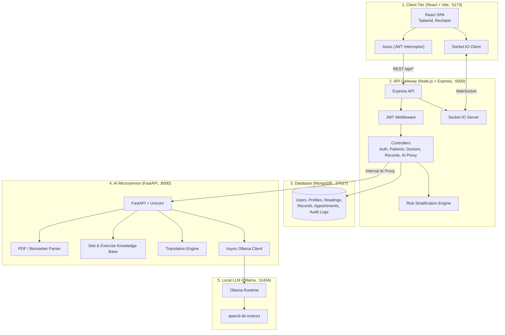
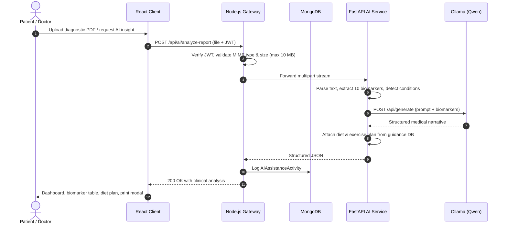

<div align="center">

# 🏥 Smart Healthcare Ecosystem

### A privacy-first telemedicine and remote health monitoring platform powered by a locally hosted LLM


</div>

---

## 📑 Table of Contents

1. [Overview](#-overview)
2. [Key Features](#-key-features)
3. [Tech Stack](#-tech-stack)
4. [System Architecture](#-system-architecture)
5. [Project Structure](#-project-structure)
6. [Getting Started](#-getting-started)
7. [Configuration](#-configuration)
8. [Default Ports](#-default-ports)
9. [Demo Accounts](#-demo-accounts)
10. [Core Workflows](#-core-workflows)
11. [AI Capabilities in Detail](#-ai-capabilities-in-detail)
12. [API Reference](#-api-reference)
13. [Security & Privacy](#-security--privacy)
14. [Resilience & Fallbacks](#-resilience--fallbacks)
15. [Troubleshooting](#-troubleshooting)
16. [Future Enhancements](#-future-enhancements)
17. [Contributing](#-contributing)
18. [Disclaimer](#-disclaimer)
19. [Author](#-author)

For a deeper technical walkthrough, see [`ARCHITECTURE_AND_WORKFLOW.md`](./ARCHITECTURE_AND_WORKFLOW.md).

---

## 🌟 Overview

The **Smart Healthcare Ecosystem** is a multi-tier digital telemedicine and remote health monitoring platform. It combines real-time vitals telemetry, electronic health record (EHR) management, doctor–patient consultations, and edge-first AI assistance in a single system.

All AI inference runs **locally** through [Ollama](https://ollama.com) using the **Qwen** model (`qwen3:4b-instruct`), so no patient data is sent to third-party AI APIs.

The platform serves three roles:

| Role | What they can do |
| --- | --- |
| **Patient** | Log vitals, view risk status, upload lab reports, get AI diet/exercise guidance, chat with an AI assistant, talk to doctors |
| **Doctor** | Monitor patients by risk level, view live telemetry, generate AI clinical summaries, issue digital prescriptions, receive emergency alerts |
| **Admin** | Manage the system and users |

---

## ✨ Key Features

- 🔒 **Privacy-first local AI** – Ollama + Qwen run on-premise; zero data leaves your machine.
- 📄 **Automated biomarker extraction** – Reads lab reports (PDF, PNG, JPG) and extracts 10 key biomarkers: Hemoglobin, Glucose, Blood Pressure, Heart Rate, SpO₂, Temperature, Total Cholesterol, WBC, RBC, Platelets. Abnormal values are flagged.
- 🥗 **Disease-specific nutrition & physiotherapy** – Diagnostic findings are mapped to meal plans and exercise regimens.
- 🩺 **Doctor Clinical Decision Support (CDSS)** – One-click case summaries with differential diagnoses, recommended workups, and red-flag warnings.
- 🌐 **12-language support** – English, Telugu, Hindi, Tamil, Kannada, Malayalam, Marathi, Bengali, Gujarati, Punjabi, Odia, Urdu.
- 🎙️ **Voice interaction** – Speech recognition for queries and text-to-speech for answers.
- 🚨 **Automated risk stratification & emergency alerts** – Vitals are scored 0–100; critical readings trigger real-time alerts to physicians.
- 💬 **Real-time chat & notifications** – Powered by Socket.IO.
- 💊 **Digital prescriptions** – Medicine, dosage, frequency, and instructions.
- 🖨️ **Printable clinical summaries** – Export lab diagnostic summaries for records or printing.
- 🧾 **AI audit logging** – Every AI interaction is logged in MongoDB (`AIAssistanceActivity`).

---

## 🛠 Tech Stack

| Layer | Technologies |
| --- | --- |
| **Frontend** | React 18, Vite, Tailwind CSS, Lucide Icons, Recharts, Axios, Socket.IO Client |
| **Backend / API Gateway** | Node.js (v18+), Express, JWT authentication, Socket.IO |
| **Database** | MongoDB |
| **AI Microservice** | Python 3.10–3.12, FastAPI, Uvicorn, PyPDF |
| **LLM Runtime** | Ollama with `qwen3:4b-instruct` (~2.5 GB) |
| **Browser APIs** | `SpeechRecognition` / `webkitSpeechRecognition`, `window.speechSynthesis` |

---

## 🏗 System Architecture



### Service Responsibility Matrix

| Service | Port | Responsibilities |
| --- | --- | --- |
| **React Frontend** | `5173` | UI, role-based dashboards, speech recognition, audio playback, report upload, print rendering |
| **Node.js Express API** | `5000` | Authentication, authorization, DB operations, business logic, WebSocket dispatch, AI proxying |
| **MongoDB** | `27017` | Users, medical records, appointments, vitals, notifications, AI audit logs |
| **FastAPI Microservice** | `8000` | NLP, document parsing, biomarker extraction, translation, voice intent mapping, clinical guidance |
| **Ollama** | `11434` | Local model execution and inference |

### Why a gateway?

The Node.js server sits between the browser and the FastAPI service, so the AI service is never directly exposed. It also handles audit logging and returns rule-based fallbacks if the AI layer is slow or unavailable.

---

## 📁 Project Structure

```
smarthealthcareecosystem/
├── ai-service/                  # Python FastAPI microservice (LLM, report parsing, translation)
├── backend/                     # Node.js + Express API, Socket.IO, MongoDB models, seed script
├── frontend/
│   └── client/                  # React + Vite single-page application
├── ARCHITECTURE_AND_WORKFLOW.md # Detailed architecture and workflow documentation
├── package.json                 # Root package configuration
├── start-all.ps1                # PowerShell launcher for all services (recommended on Windows)
├── start-ai-service.bat         # Launches the AI microservice
├── start-backend.bat            # Launches the Node.js backend
├── start-frontend.bat           # Launches the React frontend
└── .gitignore
```

---

## 🚀 Getting Started

### Prerequisites

| Requirement | Version |
| --- | --- |
| Operating System | Windows 10/11, macOS, or Linux |
| Node.js | v18.0.0 or higher |
| Python | 3.10, 3.11, or 3.12 |
| MongoDB Community Server | Running locally on port `27017` |
| Ollama | Installed from [ollama.com](https://ollama.com) |

### 1. Clone the repository

```bash
git clone https://github.com/Varshith-39/smarthealthcareecosystem.git
cd smarthealthcareecosystem
```

### 2. Set up Ollama & the Qwen model

```bash
# Start the Ollama server
ollama serve

# In another terminal, pull the model
ollama pull qwen3:4b-instruct

# Verify it is installed
ollama list
```

### 3. Set up the FastAPI AI microservice

```bash
cd ai-service

# Create and activate a virtual environment
python -m venv venv

# Windows (PowerShell)
.\venv\Scripts\Activate.ps1
# Windows (CMD)
.\venv\Scripts\activate.bat
# macOS / Linux
source venv/bin/activate

# Install dependencies
pip install -r requirements.txt

# Create the .env file (see Configuration below), then run:
uvicorn app.main:app --reload --port 8000
```

- Swagger docs: <http://localhost:8000/docs>
- Health check: <http://localhost:8000/health>

### 4. Set up the Node.js backend

```bash
cd backend
npm install

# Create the .env file (see Configuration below)

# Seed demo doctors, patients, vitals, and appointments
npm run seed

# Start the server
npm run dev
```

### 5. Set up the React frontend

```bash
cd frontend/client
npm install
npm run dev
```

Open <http://localhost:5173> in your browser.

### 6. One-click launch (Windows)

From the project root, use either option:

**Option A – PowerShell (recommended)**

```powershell
.\start-all.ps1
```

This checks Ollama status, then starts the AI service, backend, and frontend in coordinated terminals.

**Option B – Individual batch files**

1. `start-ai-service.bat` → port `8000`
2. `start-backend.bat` → port `5000`
3. `start-frontend.bat` → port `5173`

---

## ⚙️ Configuration

### `ai-service/.env`

```env
OLLAMA_BASE_URL=http://localhost:11434
OLLAMA_MODEL=qwen3:4b-instruct
NODE_BACKEND_URL=http://localhost:5000
MAX_UPLOAD_SIZE_MB=10
PORT=8000
HOST=0.0.0.0
```

### `backend/.env`

```env
PORT=5000
NODE_ENV=development
MONGO_URI=mongodb://127.0.0.1:27017/smart_healthcare
JWT_SECRET=replace_with_a_long_random_secret
CLIENT_URL=http://localhost:5173
AI_SERVICE_URL=http://localhost:8000
```

> ⚠️ **Never commit real secrets.** Generate a strong, unique `JWT_SECRET` for any non-demo deployment.

### `frontend/client/.env` (optional)

```env
VITE_API_URL=http://localhost:5000/api
```

---

## 🔌 Default Ports

| Service | Port | URL |
| --- | --- | --- |
| Frontend Web App | `5173` | <http://localhost:5173> |
| Node.js Express API | `5000` | <http://localhost:5000> |
| FastAPI Microservice | `8000` | <http://localhost:8000> |
| FastAPI Swagger Docs | `8000` | <http://localhost:8000/docs> |
| Ollama Local LLM | `11434` | <http://localhost:11434> |
| MongoDB | `27017` | `mongodb://127.0.0.1:27017/smart_healthcare` |

---

## 🔑 Demo Accounts

Created by `npm run seed` for **development and demo use only**. Change or remove these before any real deployment.

| Role | Email | Password | Details |
| --- | --- | --- | --- |
| Patient | `patient@example.com` | `Patient@123` | Rahul Verma, 34 yrs, high-risk telemetry |
| Patient | `patient.ananya@example.com` | `Patient@123` | Ananya Iyer, 28 yrs, normal telemetry |
| Doctor | `doctor@example.com` | `Doctor@123` | Dr. Aarav Sharma (Cardiologist) |
| Doctor | `doctor.priya@example.com` | `Doctor@123` | Dr. Priya Patel (Endocrinologist) |
| Doctor | `doctor.vikram@example.com` | `Doctor@123` | Dr. Vikram Malhotra (Pulmonologist) |
| Admin | `admin@example.com` | `Admin@123` | System Administrator |

---

## 🔄 Core Workflows

### Patient journey & telemetry

1. **Login** – Patient authenticates and receives a JWT with role `PATIENT`.
2. **Vitals entry** – Heart rate, blood pressure, glucose, SpO₂, and temperature are logged.
3. **Risk scoring** – `aiRiskService.js` evaluates readings and assigns `LOW`, `MEDIUM`, `HIGH`, or `CRITICAL`.
4. **Emergency escalation** – If thresholds are crossed (e.g., systolic BP > 180 or SpO₂ < 90%), an `EmergencyAlert` is created and pushed to physicians over WebSockets.

### Doctor practice & consultation

1. **Dashboard** – KPIs for total patients, confirmed appointments, high-risk flags, and emergency alerts, plus risk distribution charts.
2. **Patient surveillance** – Patients sortable by risk level with live biometric data.
3. **AI case analysis** – One-click **AI Insights** runs the full patient profile through local Qwen inference.
4. **Prescriptions** – Digital prescriptions with medicine, dosage, frequency, and instructions.

### Risk stratification engine

| Score | Level | Example |
| --- | --- | --- |
| 0–20 | `LOW` | All vitals within reference ranges |
| 21–50 | `MEDIUM` | Single mild deviation (e.g., BP 135/88) |
| 51–80 | `HIGH` | Multiple deviations (e.g., glucose 160 + BP 145/95) |
| 81–100 | `CRITICAL` | Acute abnormality (e.g., SpO₂ < 90% or HR > 130) → triggers emergency notification |

### Real-time communication (Socket.IO)

1. On login, the client connects to `http://localhost:5000`.
2. The client emits `join_user_room(userId)`.
3. The backend emits `chat_message_received` or `new_notification` to the `user_${recipientId}` room.

---

## 🤖 AI Capabilities in Detail

### End-to-end report analysis sequence



### Biomarker reference ranges

| Biomarker | Reference range |
| --- | --- |
| Hemoglobin | 13.5 – 17.5 g/dL |
| Fasting Blood Glucose | 70 – 100 mg/dL |
| Blood Pressure | < 120 / < 80 mmHg |
| Heart Rate | 60 – 100 BPM |
| SpO₂ | 95 – 100 % |
| Body Temperature | 36.5 – 37.5 °C |
| Total Cholesterol | < 200 mg/dL |
| WBC | 4,500 – 11,000 /mcL |
| RBC | 4.5 – 5.9 M/mcL |
| Platelets | 150,000 – 450,000 /mcL |

Each biomarker is tagged `Normal`, `Elevated`, `High`, or `Low`.

### Disease-specific care mapping

| Condition | Trigger | Diet | Physiotherapy |
| --- | --- | --- | --- |
| `DIABETES` | Glucose ≥ 140 mg/dL | High-fiber complex carbs, non-starchy greens, low-GI fruits, lean protein | Post-meal brisk walk (15–20 min), light cycling, resistance bands |
| `HYPERTENSION` | BP ≥ 140/90 mmHg | DASH diet, sodium < 1,500 mg/day, potassium-rich foods | Moderate walking (30 min, 5×/wk), diaphragmatic breathing, swimming |
| `ANEMIA` | Hemoglobin < 12.0 g/dL | Iron-rich foods, vitamin C enhancers | Gentle restorative yoga, low-intensity pacing |
| `DYSLIPIDEMIA` | Cholesterol ≥ 200 mg/dL | Mediterranean pattern, soluble fiber, omega-3 sources | Aerobic cardio (25 min, 4×/wk), progressive resistance training |
| `GENERAL_WELLNESS` | Normal ranges | Balanced macros, whole grains, ~2.5 L hydration | Daily mobility, core stability, 8,000–10,000 steps |

### Doctor Clinical Decision Support (CDSS)

The **AI Insights** action calls `POST /api/ai/doctor-clinical-summary`. The model returns a structured case summary:

1. Clinical impression & risk level
2. Differential diagnoses (top 3 with rationale)
3. Recommended workup
4. Therapeutic & lifestyle considerations
5. Red flags & critical warning signs

A **Copy to Consultation** button lets doctors paste the result directly into prescription notes.

### Multilingual translation

| Language | Code | Language | Code |
| --- | --- | --- | --- |
| English | `en-US` | Bengali | `bn-IN` |
| Telugu (తెలుగు) | `te-IN` | Gujarati (ગુજરાતી) | `gu-IN` |
| Hindi (हिन्दी) | `hi-IN` | Punjabi (ਪੰਜਾਬੀ) | `pa-IN` |
| Tamil (தமிழ்) | `ta-IN` | Odia (ଓଡ଼ିଆ) | `or-IN` |
| Kannada (ಕನ್ನಡ) | `kn-IN` | Urdu (اردو) | `ur-IN` |
| Malayalam (മലയാളം) | `ml-IN` | Marathi (मराठी) | `mr-IN` |

### Voice & text-to-speech

1. **Speech-to-text** – Browser `SpeechRecognition` localized to the selected language.
2. **Intent parsing** – Transcript is sent to `POST /api/voice/process` on the FastAPI service.
3. **Action dispatch** – e.g., *"What food should I eat?"* triggers `SCROLL_DIET` plus a spoken reply.
4. **Playback** – `window.speechSynthesis` reads answers aloud in a matching locale.

---

## 📡 API Reference

All endpoints are served through the Node.js gateway at `http://localhost:5000/api` and require `Authorization: Bearer <JWT>`.

### `POST /api/ai/chat` – AI health assistant

**Request**

```json
{
  "message": "What foods should I avoid if my fasting glucose is 145 mg/dL?",
  "language": "English",
  "simpleLanguage": false
}
```

**Response**

```json
{
  "success": true,
  "data": {
    "reply": "With a fasting glucose of 145 mg/dL, you should limit refined carbohydrates...",
    "disclaimer": "This information is for educational purposes only. Always consult your doctor before modifying your diet.",
    "language": "English",
    "model_used": "qwen3:4b-instruct"
  }
}
```

### `POST /api/ai/doctor-clinical-summary` – Clinical decision support

**Request**

```json
{
  "patientName": "Rahul Verma",
  "age": 34,
  "gender": "Male",
  "bloodGroup": "B+",
  "vitals": {
    "systolicBP": 145,
    "diastolicBP": 95,
    "heartRate": 88,
    "spo2": 97,
    "bloodGlucose": 155,
    "temperature": 36.8
  },
  "riskLevel": "HIGH",
  "conditions": ["Elevated Blood Glucose", "Stage 1 Hypertension"]
}
```

**Response** – returns a `summary` (clinical impression, differentials, workup, therapy, red flags), `model_used`, and `timestamp`.

### `POST /api/ai/analyze-report` – Medical report analysis

- **Content-Type:** `multipart/form-data`
- **Form fields:**
  - `reportFile` – `.pdf`, `.jpg`, or `.png` (max 10 MB)
  - `language` – e.g., `"Telugu"`
  - `simple_language` – `true` / `false`

**Response (abridged)**

```json
{
  "success": true,
  "data": {
    "fileName": "blood_panel_rahul.pdf",
    "summary": "Report indicates elevated fasting blood glucose (145 mg/dL) and hypertension...",
    "detected_conditions": ["Type 2 Diabetes / Elevated Blood Glucose", "Hypertension"],
    "parameters": [
      { "name": "Blood Glucose", "value": "145", "unit": "mg/dL", "status": "Elevated" },
      { "name": "Blood Pressure", "value": "145/95", "unit": "mmHg", "status": "High" }
    ],
    "expert_diet": { "recommendedFoods": ["Spinach", "Quinoa", "Lentils"] },
    "expert_exercises": {
      "exercisesTable": [
        { "exercise": "Brisk Walking", "duration": "20–30 min", "frequency": "5 days/week" }
      ]
    }
  }
}
```

### FastAPI internal endpoints

| Endpoint | Purpose |
| --- | --- |
| `POST /api/report/analyze` | Report parsing and biomarker extraction |
| `POST /api/voice/process` | Voice intent mapping |
| `GET /health` | Health check |
| `GET /docs` | Swagger UI |

---

## 🔐 Security & Privacy

- **Local inference** – Patient data is processed by Ollama on your own hardware.
- **JWT authentication** – Role-based access (`PATIENT`, `DOCTOR`, `ADMIN`).
- **Isolated AI service** – FastAPI is reached only through the Node.js gateway.
- **CORS allow-list** – Only `localhost` / `127.0.0.1` on ports `5173` and `3000` are permitted, with credentials.
- **Upload validation** – MIME type and size (10 MB) checks before forwarding.
- **Audit trail** – AI usage is recorded in the `AIAssistanceActivity` collection.

> For production use, add HTTPS, rotate secrets, remove demo accounts, restrict CORS to your real domain, and review applicable healthcare data-protection regulations.

---

## 🛡 Resilience & Fallbacks

If Ollama is loading, busy, or restarting:

- FastAPI catches the timeout and switches to **pre-compiled clinical rule engines**.
- Node.js catches connection failures and returns a **structured clinical fallback** instead of an HTTP 500.
- The user sees accurate guidance with an informative banner, with no UI disruption.

The frontend Axios client uses a 90-second timeout to accommodate LLM inference.

---

## 🧰 Troubleshooting

| Problem | Fix |
| --- | --- |
| AI responses are slow or fall back to rule-based output | Make sure `ollama serve` is running and `qwen3:4b-instruct` appears in `ollama list` |
| `MongoNetworkError` / backend won't start | Confirm MongoDB is running on `27017` and `MONGO_URI` is correct |
| CORS errors in the browser | Ensure `CLIENT_URL` matches the frontend origin (`http://localhost:5173`) |
| PowerShell blocks venv activation | Run `Set-ExecutionPolicy -Scope CurrentUser RemoteSigned` |
| Login fails with demo accounts | Re-run `npm run seed` in `backend/` |
| Port already in use | Stop the conflicting process or change the port in the relevant `.env` |

---

## 🔮 Future Enhancements

- Integration with wearables and IoT devices for automatic vitals ingestion
- Video consultations (WebRTC)
- Appointment reminders via SMS/email
- OCR improvements for scanned reports
- Docker Compose setup for one-command deployment
- Automated test suite and CI/CD pipeline
- Larger or fine-tuned medical LLMs

---

## 🤝 Contributing

Contributions are welcome.

1. Fork the repository
2. Create a feature branch: `git checkout -b feature/your-feature`
3. Commit your changes: `git commit -m "Add your feature"`
4. Push the branch: `git push origin feature/your-feature`
5. Open a Pull Request

---

## ⚠️ Disclaimer

This project is an academic/educational system. AI-generated output (summaries, diet plans, exercise suggestions, differential diagnoses) is **informational only** and is **not a substitute for professional medical advice, diagnosis, or treatment**. Always consult a qualified healthcare professional.

---

## 👤 Author

**Varshith** – [@Varshith-39](https://github.com/Varshith-39)

Built as a B.Tech Final Year Major Project.

---

<div align="center">

⭐ If you found this project useful, consider giving it a star!

</div>
